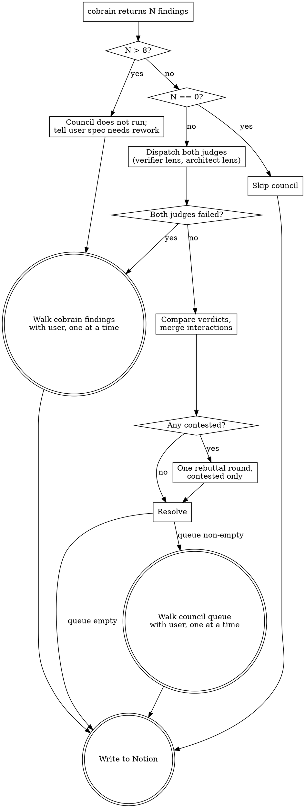

# Design: adversarial-council skill and adversarial-judge agent

Date: 2026-08-27
Branch: `claude/adversarial-council-skill-d3461e`

## Summary

Two new artifacts in the architect skill stack:

* `adversarial-judge`, an agent that runs on Opus. It reads a set of review
  findings and classifies each one. It decides whether a finding is real, and
  whether resolving the finding needs a decision that only the user can make.
* `adversarial-council`, a skill that the main thread runs. The skill sends the
  same findings to two judges, gives each judge a different view of the
  evidence, compares the two sets of verdicts, and runs one rebuttal round on
  the findings where the judges disagree.

The `architect` skill gains a step between the `architect-cobrain` review and
the step where the user addresses the review. The council filters the findings.
The user then sees only the findings that need a decision, and sees them one at
a time.

### Problem this solves

The `architect-cobrain` agent returns every finding it has. Some of those
findings are real problems that need a decision from the user. Others are minor,
or already handled in the codebase, or have one obviously correct fix that needs
no discussion.

Today the `architect` skill walks all of them with the user. The user pays
attention to each one, and much of that attention buys nothing. Attention spent
on a finding that has one correct answer is attention that is not available for
the finding that has a real tradeoff.

The architect step also gates a spec that becomes a stack of pull requests and a
set of Notion pages. A wrong filter here is expensive, so the filter must be
adversarial rather than a single model's opinion.

### Non-goals

* The council does not review the spec. It reviews findings about the spec. The
  judges never add a finding that `architect-cobrain` did not report.
* The council does not edit the spec. It classifies. The main thread applies the
  changes.
* The council does not replace `architect-cobrain`. Cobrain still produces the
  findings.
* The council does not replace the user gate. It makes that gate shorter.
* The council does not write to Notion, and the judges hold no Notion tools.

## Model choice

`architect-cobrain` runs on Fable and produces the findings. The judges run on
Opus and filter them. The cheaper and faster model does the first sweep. The
more capable model decides what reaches the user.

This order is deliberate. A first sweep that reports too much costs little,
because the council removes the noise. A filter that removes a real problem
costs a wrong spec, so the filter gets the stronger model.

## Files

```
plugins/soong/
├── agents/adversarial-judge.md              # new: one judge, dispatched twice
└── skills/adversarial-council/SKILL.md      # new: main-thread orchestration
```

One edit: `plugins/soong/skills/architect/SKILL.md` gains Step 3.5 and changes
Step 4.

One further change: bump `version` in
`plugins/soong/.claude-plugin/plugin.json` from `0.7.1` to `0.8.0`. The
repository `CLAUDE.md` requires a minor bump for a feature.

No hook. No script. Both new artifacts are instructions, and there is no
mechanical work to shell out to.

No test file. The existing scripts in this plugin carry `.test.sh` files because
they are shell with branching. There is no executable logic here to assert
against.

## Component 1: adversarial-judge agent

### Frontmatter

```yaml
---
name: adversarial-judge
description: Judges a set of architecture review findings and classifies each
  one as drop, auto-resolve, needs-user, or abstain. Dispatched twice by the
  adversarial-council skill, once per evidence lens. Read-only - never edits
  files and never writes to Notion.
model: opus
tools: Read, Grep, Glob, Bash
---
```

### Purpose

The judge answers one question per finding: does resolving this finding need a
decision that only the user can make?

The judge does not ask whether the finding is interesting. It asks whether the
user must decide something. A real problem with one correct fix does not need
the user. A small problem with a genuine tradeoff does.

### Lenses

The council dispatches the same agent twice. The prompt names which lens the
judge holds, and the lens sets which evidence the judge reasons from.

**Verifier lens.** Receives the spec, the findings, and the files each finding
names. The judge reads those files. It answers from the code: is this finding
true of the codebase as it stands?

**Architect lens.** Receives the spec, the findings, and the pull request stack
with its order and stated dependencies. It answers from the design: does
resolving this change what gets built, or only how a step gets built? It does
not read the implementation, including to check whether a finding is true. A
finding it cannot judge from the stack alone is an abstention.

Both lenses answer the same question and return the same shape. The lens changes
the evidence, not the job. Each lens's evidence is a closed set, and a judge
that reaches outside it produces agreement that carries no information, which is
the one thing the two-lens design exists to prevent.

### Rationale for lenses over roles

An earlier option gave one judge the role of prosecutor and the other the role
of defender. That option was rejected. A judge told to attack will attack a
correct finding, and a judge told to defend will defend a broken one. The result
is two well-argued positions and no signal about which is true.

Two judges with the same prompt and the same model tend to reach the same
verdict, which turns the council into a rubber stamp. Different evidence rather
than different roles is what makes agreement mean something.

### Output per finding

* **Verdict**, one of:
  * `drop` - not real, already handled, or too minor to spend anyone's
    attention on. Judged from this lens's evidence: the verifier lens may drop
    on what the code does, and the architect lens drops on design grounds
    alone, never on a claim about the code it has not read.
  * `auto-resolve` - real, and one fix is obviously correct. The judge states
    the fix.
  * `needs-user` - real, and resolving it needs a decision the user owns: a
    tradeoff with no dominant answer, a scope or priority call, a product
    question, or a risk only the user can accept.
  * `abstain` - cannot judge from this lens's evidence, either because the
    evidence does not reach the finding or because it reaches it and does not
    settle it. The judge states what it would need. When unsure whether a
    finding is too minor to matter or simply beyond the lens, abstain: a shared
    `drop` ends the finding, and an abstention only escalates it.
* **Reasoning**, one or two sentences, from this lens's evidence.
* **The question**, only when the verdict is `needs-user`. The decision, written
  as a question, with its options. The user sees this text, so the judge writes
  it rather than the main thread.

### Output per dispatch

One **Interactions** list, written once and not per finding. It names findings
that duplicate each other, and findings where accepting one makes another moot.
Each entry names the findings it links and states the relationship in one
sentence.

This list is why the council sends all findings to one judge in one dispatch
instead of sending one finding at a time. A judge that sees the whole set can
see that two findings are the same concern. A judge that sees one finding cannot.

An Interactions entry never changes a verdict. It changes how the main thread
presents the findings to the user, which the council skill covers below.

### Read-only rule

The judge holds `Bash`, so the no-edit rule is not enforced by the tool grant.
The agent file states the rule the same way `architect-cobrain` states it: use
`Bash` to read only, through `git log`, `git diff`, `git show`, `ls`, and `rg`.
No redirects. No `sed -i`. No `git` command that changes state.

The judge holds no Notion tools by design.

### No new findings

The agent file states the constraint where the behavior originates, and not only
in the council skill: the judge classifies the findings it receives, and reports
no finding of its own. A problem the judge notices that cobrain did not report
belongs in that judge's reasoning for a related finding, and does not become a
new entry. The council discards any verdict for a finding cobrain did not report,
so a judge that invents one produces nothing.

## Component 2: adversarial-council skill

### Frontmatter

```yaml
---
name: adversarial-council
description: Filter a set of architecture review findings down to the ones that
  need a decision from the user. Sends the findings to two adversarial-judge
  agents on different evidence lenses, runs one rebuttal round where they
  disagree, and returns what to drop, what to auto-apply, and what to ask.
  Use after architect-cobrain returns findings, or when the user runs
  /soong:adversarial-council.
---
```

### Inputs

* The findings from `architect-cobrain`, with each finding's severity.
* The spec path.
* The pull request stack, as an ordered list.
* The files or globs each finding touches.

### Where the orchestration runs

The main thread runs it. The council is a skill and not an agent.

The council's output includes questions for the user, and a subagent cannot ask
the user anything. A council that ran as an agent would have to return a list
and let the main thread ask, which loses the judges' reasoning and reproduces
the batch of questions this design exists to remove.

The judges' verdicts land in main-thread context. That is acceptable. They are
structured verdicts rather than transcripts, and their reasoning is what the
main thread needs when it asks the user.

### The cap

The council runs on eight findings or fewer.

Above eight, the council does not run. The skill tells the user that cobrain
returned more findings than the council filters, and that the spec needs rework.
The findings then go to the user one at a time, which is the behavior the
`architect` skill had before this change.

The cap is a signal and not a resource limit. Nine or more findings means the
spec is unsound. Filtering an unsound spec down to "only what needs your input"
tells the user that everything else was fine, and that is the wrong message.

Two rejected alternatives. Running the council on the top eight by severity
splits the findings into two tiers of trust with no basis. Telling cobrain to
cap its own output at eight hides the signal entirely, because cobrain then
drops findings it believes are real.

### Zero findings

The council does not run. There is nothing to filter.

### Dispatch

Both judges go out in one message so they run at the same time. Each receives
the full finding set, the spec, and its own lens's evidence.

### Resolution

The main thread compares the two verdict sets per finding. The rules are ordered,
and the first one that matches decides.

| # | Condition | Outcome |
| --- | --- | --- |
| 1 | both judges `abstain` | straight to the user, skipping any rebuttal |
| 2 | either judge `abstain` | contested |
| 3 | both judges same verdict | act on that verdict |
| 4 | verdicts differ | contested |

Rule 1 precedes rule 3 on purpose. Two judges that both `abstain` do agree, but
they agree that neither can judge the finding, and there is no verdict to act on.
A rebuttal round between two judges who both said they lack evidence produces
nothing, so the finding skips the round and goes to the user with each judge's
stated reason for abstaining. Nothing the council cannot judge is ever dropped.

An `abstain` from either judge is otherwise a split. Uncertainty never counts as
agreement.

A finding that a judge did not return a verdict for counts as `abstain`. A
verdict for a finding that cobrain did not report is discarded.

The four rules cover all sixteen pairs of the four verdict values. One pair, both
`abstain`, takes rule 1. Six pairs where exactly one judge abstains take rule 2.
Three pairs, both `drop`, both `auto-resolve`, or both `needs-user`, take rule 3.
The remaining six pairs take rule 4.

Order matters for the seven pairs that match more than one rule, and changes the
outcome for one of them: both `abstain`, which rule 1 claims before rule 3 can
treat it as agreement. The other six are the one-judge-abstain pairs, which match
rules 2 and 4 and get "contested" from either.

### Using the Interactions lists

The main thread merges both judges' Interactions lists and uses the result only
when it presents findings to the user:

* Findings the judges called duplicates are asked as **one** question, naming
  every finding it covers.
* When accepting finding A makes finding B moot, A is asked first, and B is
  asked only if the user's answer to A leaves it standing.

An entry that appears on one judge's list and not the other's still applies. The
lists say which findings relate, not whether a finding is real, so there is
nothing to reconcile between them and one judge noticing a link is enough. An
entry that names a finding that does not exist is discarded, as with verdicts.

The rebuttal round does not carry the Interactions lists. The rebuttal settles
verdicts, and an entry cannot change a verdict.

### Rebuttal round

Contested findings go to one rebuttal round, and one only. Both judges are
dispatched again. Each sees the other's verdict and reasoning for the contested
findings, and each keeps its own lens.

The rebuttal carries the contested subset only. Findings the judges already
agreed on are not re-litigated.

One round means one round. A finding still contested after the round goes to the
user, and the council does not dispatch a third time to try to settle it. The
skill states this as a rule rather than leaving it implied, because a second
round of disagreement reads as an invitation to run a third, and a council that
keeps arguing never reaches the user.

After the round, the same four ordered rules apply again to the two fresh
verdicts. Only rule 3 can now act on a finding, and it acts only on a shared
`drop`, `auto-resolve`, or `needs-user`. Rules 1, 2, and 4 all send the finding
to the user, because there is no further round to send it to:

* **Rule 3, converged.** Act on the shared verdict.
* **Rule 4, still split.** The finding becomes a question for the user, and the
  user sees **both** judges' positions rather than one merged summary. A real
  disagreement between two informed judges is information, and merging it into
  one paragraph throws that information away.
* **Rules 1 and 2, an `abstain` on either side or both.** The finding goes to the
  user with each judge's stated reason. A shared `abstain` is never acted on. It
  is agreement that neither judge can judge the finding, which is the same
  undefined state before the round and after it.

### Acting on agreement

* `drop` - dropped, and the user is not told. One exception below.
* `auto-resolve` - the main thread applies the fix to the spec. The council
  lists every fix it applied when it reports.
* `needs-user` - queued for the user.

### The blocking exception

The council may drop a finding that cobrain marked `blocking`. A unanimous drop
of a `blocking` finding produces a one-line notice to the user.

The notice is not a question and does not wait for an answer. It exists so that
a swallowed blocker is visible. Without it, the council's most consequential
decision would be its most silent one.

The exception applies to a shared `drop` in either round. A drop the judges
reached only after arguing is still a drop, and a blocker the user never hears
about is the thing the notice exists to prevent.

### Output

* The queue of findings for the user, each with its question, and with both
  positions where the judges stayed split.
* The list of fixes applied under `auto-resolve`.
* One-line notices for dropped `blocking` findings.
* A count of findings dropped silently.

### Failure

* **One judge fails, or returns output the main thread cannot parse.** Every
  finding in that set is contested. The council never decides a finding on one
  judge's verdict.
* **The same judge fails again in the rebuttal round.** Every finding stays
  contested, so every finding goes to the user. There is no second rebuttal, and
  the council does not fall back to the surviving judge's verdicts. One judge's
  opinion is not a council.
* **Both judges fail.** The council reports the failure. Every finding goes to
  the user one at a time, which is the pre-council behavior.

A council failure must never make a finding disappear. Every failure path above
ends with the findings in front of the user rather than resolved without one.

### Standalone use

The user invokes the skill as `/soong:adversarial-council`. It works outside the
`architect` skill, and needs findings supplied to it. With no findings, the skill
asks for them. It never produces a review of its own to fill the gap.

## Component 3: architect skill changes

### New Step 3.5

Between the current Step 3, which dispatches `architect-cobrain`, and the
current Step 4, which addresses the review with the user.

Step 3.5 invokes `adversarial-council` with cobrain's findings, the spec path,
the pull request stack, and the files each finding touches.

### Changed Step 4

Step 4 walks a queue rather than every cobrain finding by default. Which queue
depends on whether the council ran:

* **The council ran.** Step 4 walks the council's queue.
* **The council did not run**, because the findings were over the cap or because
  both judges failed. Step 4 walks the full cobrain finding set, in cobrain's
  priority order. This is the behavior the skill had before this change.

The rest of Step 4 is unchanged in both cases: one finding per message, the main
thread gives its own read and may disagree with a judge, the user decides, and
accepted changes go into the spec. The user is never shown a batch of findings in
one message, whichever queue Step 4 is walking.

An empty council queue means the council resolved everything. Step 4 says so,
lists the fixes applied under `auto-resolve`, and proceeds to Notion. An empty
cobrain finding set means the same thing without a council, and Step 4 proceeds.

### Gates that do not change

* Step 4 stays the last checkpoint before Notion. The council shortens the
  review and does not remove it.
* Cobrain is re-dispatched only when a pull request is added, removed, or
  re-ordered. When a council decision changes the stack, cobrain runs again, and
  the council then runs on the new findings.
* The main thread may still disagree with a judge when it presents a finding.
  The council decides what reaches the user. It does not outrank the main
  thread's judgment on what to do about it.

## Flow



## Cost

Two Opus dispatches per architect run when the judges agree on everything. Four
when any finding is contested. The rebuttal carries the contested subset, so the
second round is smaller than the first.

A rejected alternative sent one finding per dispatch. Six findings would have
cost twelve to twenty-four Opus dispatches. That is slow enough that the user
skips the council, and a step the user skips protects nothing. Per-finding
dispatch also cannot produce the Interactions list, because a judge that sees
one finding cannot see that two findings are the same concern.

## Testing

Both artifacts are prose, so there is no unit to assert against and no test file
ships. Verification is manual, through real architect runs on this repository.

1. A spec with a mix of finding kinds: one already handled in the code, one with
   one obviously correct fix, one with a real tradeoff. Confirm the first is
   dropped silently, the second is applied and reported, and the third reaches
   the user as a question.
2. A spec that produces nine or more findings. Confirm the council does not run,
   the user is told the spec needs rework, and the findings arrive one at a time.
3. A finding cobrain marked `blocking` that both judges drop, once where they
   agree in the first round and once where they agree only after the rebuttal.
   Confirm the one-line notice appears in both, and does not ask for an answer.
4. A finding the two lenses read differently. Confirm exactly one rebuttal round
   runs, and that a finding still split afterwards reaches the user with both
   positions shown.
5. A finding neither lens can judge. Confirm it reaches the user without a
   rebuttal round.
6. A finding that goes to a rebuttal round and comes back with an `abstain` on
   one or both sides. Confirm it reaches the user, that no third dispatch runs,
   and that a shared `abstain` is not treated as a verdict to act on.
7. Any run. Confirm no judge edited a file, and that the user was never shown two
   findings in one message.

## Open questions

None.

## Decisions and rejected alternatives

| Decision | Chosen | Rejected |
| --- | --- | --- |
| What the council reviews | Cobrain's findings | Replacing cobrain with two judges; reviewing the spec and the findings together |
| How judges differ | Same prompt, different evidence lens | Prosecutor and defender roles |
| Rounds | One rebuttal on contested findings only | Single round; N rounds; a third judge to break ties |
| Batch shape | All findings in one dispatch | One dispatch per finding |
| Above the cap | Council does not run, user walks all findings | Council runs on the top eight; cobrain caps its own output |
| Who orchestrates | Main thread, through a skill | A council agent that dispatches the judges |
| Unresolved disagreement | Goes to the user, with both positions | A third judge decides |
| Both judges abstain | Straight to the user, skipping any rebuttal | Treated as agreement; a rebuttal round between two judges who lack evidence |
| Dropping a `blocking` finding | Allowed, with a one-line notice | Forbidden; allowed silently |

A third judge to break ties was rejected because a genuine split on "does this
need a human decision?" is itself the answer. A tiebreaker that overwrites the
split optimizes for not asking the user, which is the opposite of the goal.
